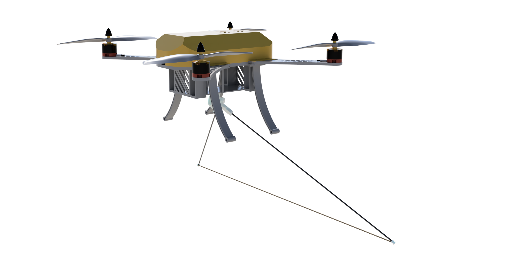
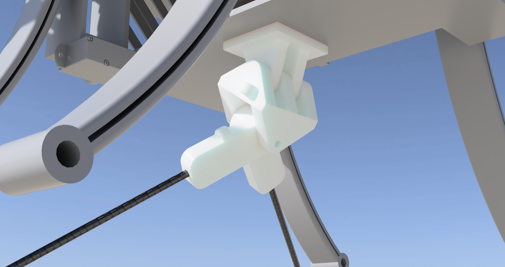
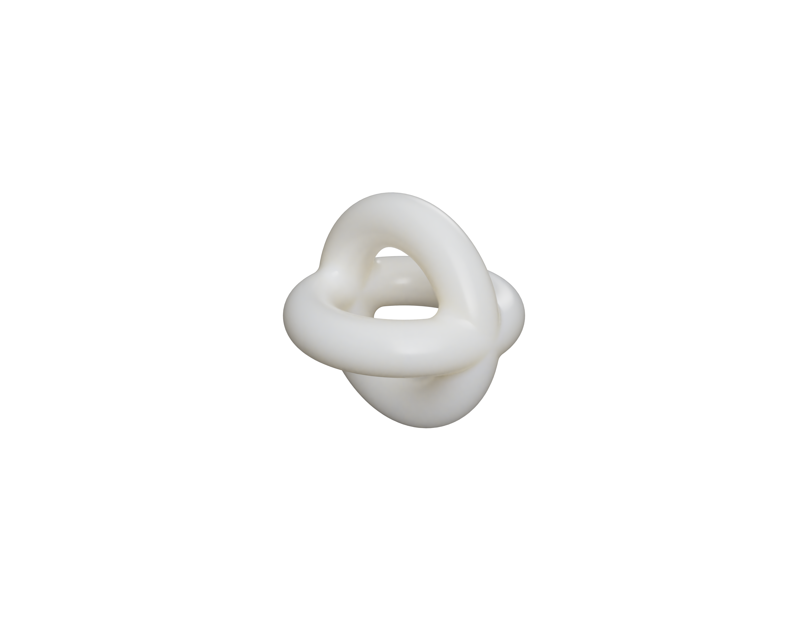
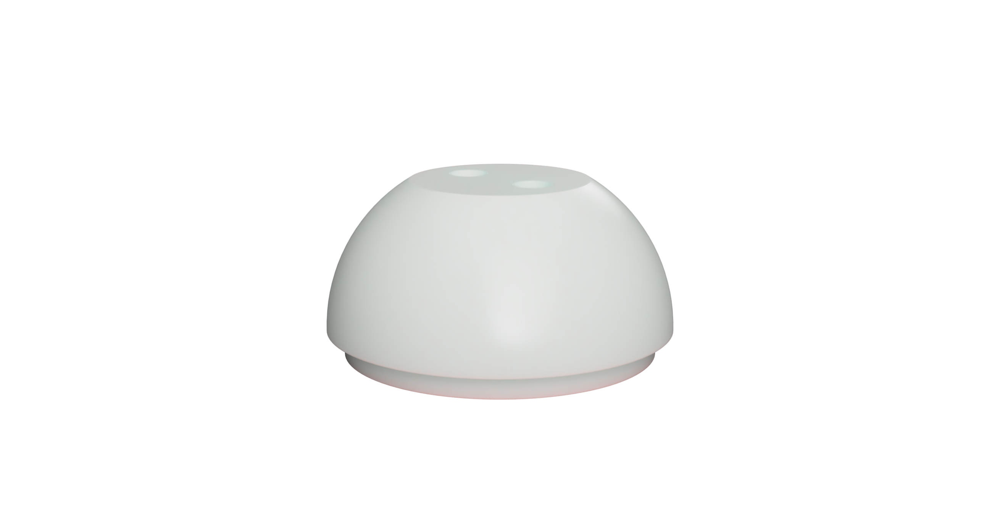

# Autonomous Underwater Vehicles Arial Retrieval Manipulator

### Abstract
Research vessels often face delays during the deployment and retrieval of Autonomous Underwater Vehicles (AUVs) at sea. Automating this process using drones can significantly improve efficiency. This project focuses on developing effective gripping mechanisms for drone-based AUV retrieval. The main challenge is to ensure the gripping mechanism is accurate enough to attach to the AUV without compromising the drone's flying ability. Two mechanisms are compared: a hook design and a string-bow design. The string-bow design offers a wider x-y angle range and greater z tolerance, accommodating variable AUV orientations and rough sea states. Conversely, the hook design requires careful determination of the suitable length to ensure effective attachment. Techniques such as compliant mechanisms with print-in-place hinges, 3D printing, and carbon fiber construction are employed to minimize weight and reduce aerodynamic impact. Increasing the margin for error when the drone attaches to the AUV is crucial. The gripping mechanism is designed with a larger tolerance for misalignment, ensuring reliable attachment. Physical testing on a scaled-down model simulates real-world conditions, providing insights into performance and reliability. The goal is to create a gripping mechanism that maximizes the margin for future flight algorithms, facilitating precise AUV retrieval and enhancing the efficiency of marine research activities.

# Designs

## Design A - Stringbow

[String Bow Compiled](https://a360.co/4cPGFe4)

## Design B - Hook and Line

[Carbon Fiber Hook](https://a360.co/3SjiiNE)

## Misc
[Bouye](https://a360.co/3SjiiNE)

[AUV Model Cap](https://a360.co/3Yz7sY3)
